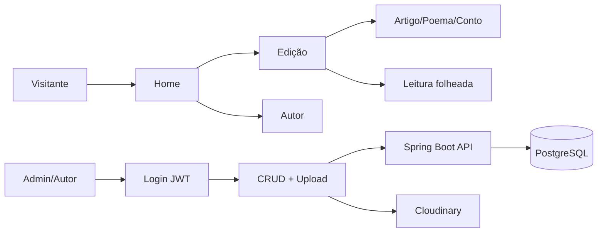

# Wireframes (baixa fidelidade)

Convenções: `[ ]` área de conteúdo, `|` separadores de coluna, anotações em itálico.

## Home (capa da revista)

```
┌──────────────────────────────────────────────────────────────┐
│  LOGO REVISTA          Edição atual  Autores  Busca  [Menu]   │
├──────────────────────────────────────────────────────────────┤
│  ┌────────────────────────────────────────────────────────┐  │
│  │     [ FOTO DE CAPA — full width, proporção 16:9 ]        │  │
│  │     Título da revista / mês • ano                         │  │
│  │     Chamada editorial em uma linha                        │  │
│  │     [ Ler edição atual ]                                   │  │
│  └────────────────────────────────────────────────────────┘  │
├──────────────────────────────────────────────────────────────┤
│  Destaques da edição                                         │
│  ┌──────────┐ ┌──────────┐ ┌──────────┐                    │
│  │ thumb    │ │ thumb    │ │ thumb    │                    │
│  │ título   │ │ título   │ │ título   │                    │
│  └──────────┘ └──────────┘ └──────────┘                    │
├──────────────────────────────────────────────────────────────┤
│  Autores em destaque (carrossel ou grid)                     │
│  [ foto ] Nome    [ foto ] Nome    [ foto ] Nome             │
├──────────────────────────────────────────────────────────────┤
│  Por seção: Editorial | Artigos | Poemas | Contos            │
│  (links ou blocos com 2–3 itens cada)                        │
├──────────────────────────────────────────────────────────────┤
│  Rodapé: Sobre | Contato | Redes | Newsletter                │
└──────────────────────────────────────────────────────────────┘
```

## Listagem de edições

```
┌────────────────────────────────────────┐
│  Header                                 │
├────────────────────────────────────────┤
│  Edições                                │
│  ┌────────┐ ┌────────┐ ┌────────┐     │
│  │ capa   │ │ capa   │ │ capa   │     │
│  │ nº /   │ │ nº /   │ │ nº /   │     │
│  │ data   │ │ data   │ │ data   │     │
│  └────────┘ └────────┘ └────────┘     │
└────────────────────────────────────────┘
```

## Página de uma edição

```
┌────────────────────────────────────────┐
│  Header + breadcrumb: Home > Edições   │
├────────────────────────────────────────┤
│  [ Capa 16:9 ]                          │
│  Título edição • Data • Nº             │
│  Lista de autores (chips ou avatares)   │
├────────────────────────────────────────┤
│  Editorial (texto introdutório)       │
├────────────────────────────────────────┤
│  Sumário: Artigos | Poemas | Contos     │
│  (lista com título + autor + link)      │
├────────────────────────────────────────┤
│  Galeria desta edição                   │
│  [ img ] [ img ] [ img ] ...            │
└────────────────────────────────────────┘
```

## Artigo / poema / conto (leitura)

```
┌────────────────────────────────────────┐
│  [ Imagem destaque 16:9 ]               │
│  Categoria · Edição · Data              │
│  Título grande (serif)                  │
│  [ foto ] Nome do autor · bio curta     │
├────────────────────────────────────────┤
│  |  largura máxima ~65ch                │
│  |  corpo com tipografia confortável    │
│  |  citações, intertítulos              │
│  |  modo leitura / noturno (toggle)     │
├────────────────────────────────────────┤
│  Compartilhar · Voltar à edição         │
└────────────────────────────────────────┘
```

## Admin — login

```
┌──────────────────────┐
│  Logo                 │
│  [ Email        ]     │
│  [ Senha        ]     │
│  [ Entrar ]           │
└──────────────────────┘
```

## Admin — dashboard (esqueleto)

```
┌───────────┬────────────────────────────────────┐
│ Nav       │  Resumo: edições rascunho,         │
│ Edições   │  posts agendados                  │
│ Conteúdos │                                    │
│ Autores   │  [ Atalhos: nova edição, novo     │
│ Galerias  │   artigo, upload ]                │
│ Imagens   │                                    │
│ Sair      │                                    │
└───────────┴────────────────────────────────────┘
```

## Leitura folheada (Issuu / Flipsnack)

```
┌────────────────────────────────────────────────────────────────┐
│  [← Sumário]  [← Ant.]   Página 3 / 24   [Próx.]  [- zoom +]   │
├────────────────────────────────────────────────────────────────┤
│         ┌──────────────────┬──────────────────┐                  │
│         │  página esquerda │ página direita  │  (modo paisagem) │
│         │  ou página única em mobile         │                  │
│         └──────────────────┴──────────────────┘                  │
│  Painel lateral: Sumário (salta para capítulo / página)       │
└────────────────────────────────────────────────────────────────┘
```

Implementação atual: `/edicoes/20/revista` (StPageFlip via `react-pageflip`).

## Fluxo (diagrama)


